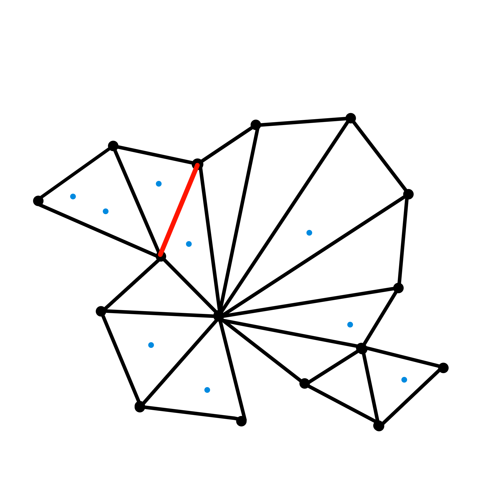
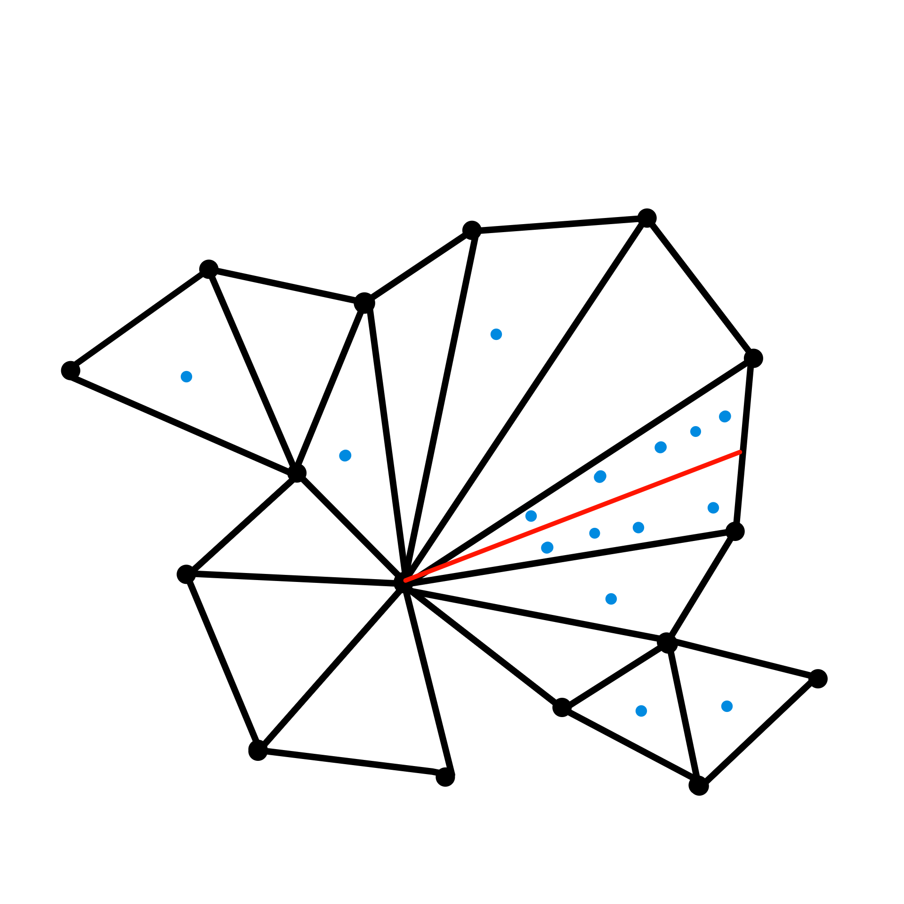
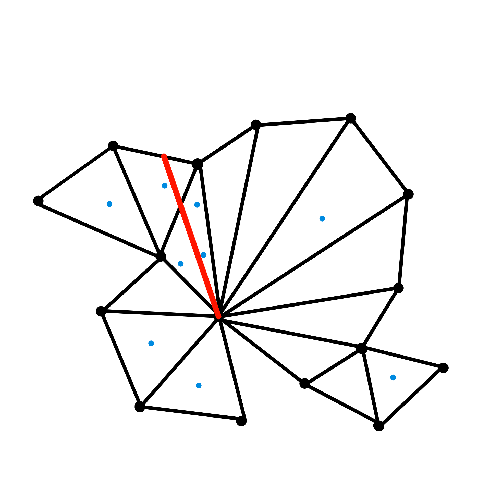
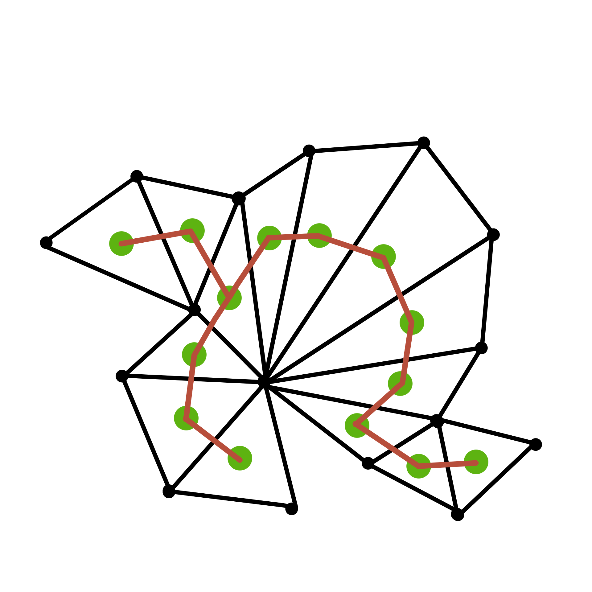
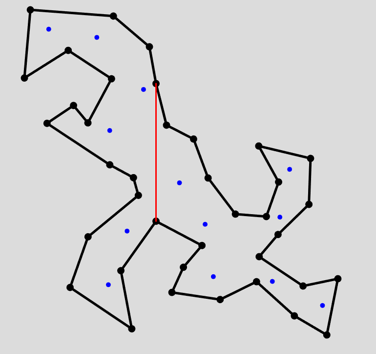
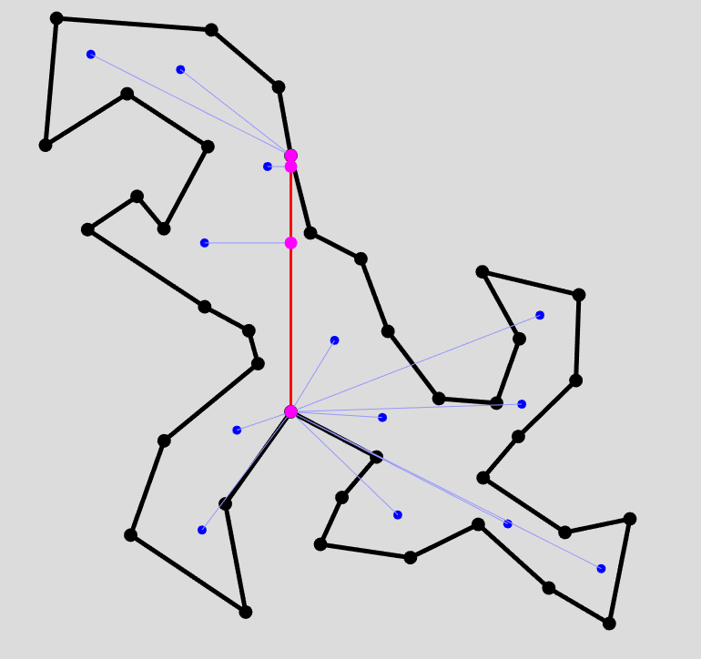
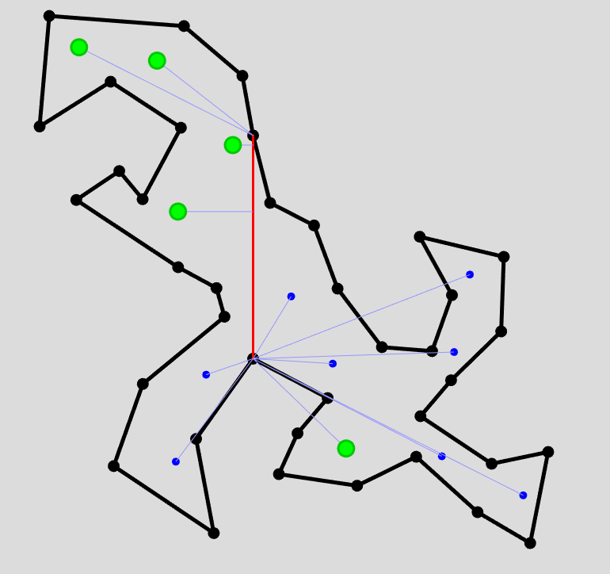
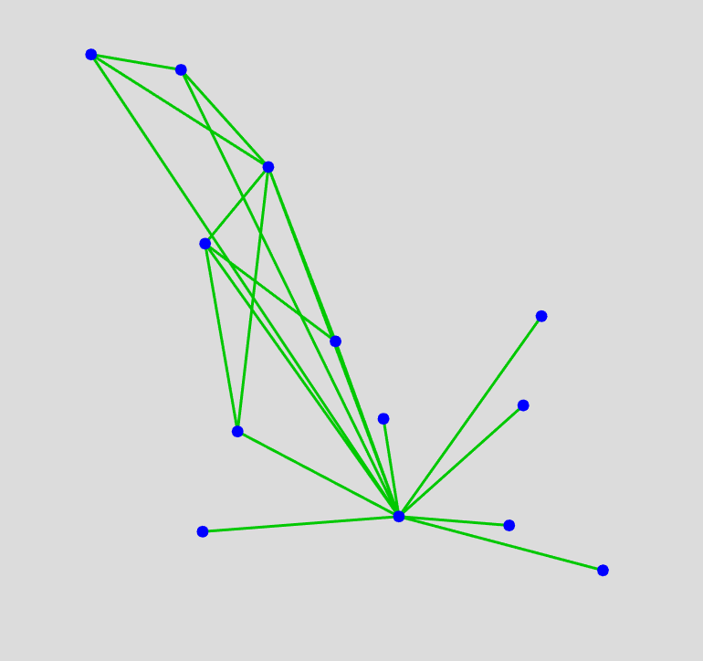

# CG-Geometric-Spanners-inside-Polygon
This repository was created for the Computational Geometry course project.
We are gonna implement an algorithm to compute **the geometric spanners for points inside a polygonal domain**.
This project uses **Typescript** for the core implementation and JavaScript's **p5.js** library for visualization and interactive environment.

## Setup Instructions
1) Install node.js version v22.21.0 (LTS) using nvm with npm package manager:
   * https://nodejs.org/en/download
   * For Windows you can use Chocolatey or install using a Windows Installer (.msi)
2) Install TypeScript using npm in the project's home directory
   * ```npm install typescript --save-dev```
   * https://www.typescriptlang.org/download/
3) Compile the TypeScript files to JavaScript using the following:
   * ```npx tsc```

## Project Structure
TypeScript code is found within the src/ directory.  
It will compiled to the dist/ directory.  

# Report

# **Introduction**

Computational geometry often studies how to build efficient networks that approximately preserve pairwise distances.

In the classical Euclidean setting, this leads to the concept of a **t-spanner**, a sparse graph where distances measured along the graph closely approximate true geometric distances in space.

The goal of this project is to implement the key components of the algorithm presented in the SoCG 2015 paper “Geometric Spanners for Points Inside a Polygonal Domain”.
this paper constructs a **sparse graph** (**a geodesic** **spanner**) that approximates **geodesic distances** between points inside a polygon.
The challenge is to create a graph with **few edges**, yet still guarantee that every pair of points has a path that is at most $(\sqrt{10}+ε)$ times longer than the true shortest geodesic path inside the polygon. 

The paper constructs a geodesic spanner inside a polygon through these steps:

### 1. Split the polygon with a vertical segment ℓ

A vertical splitting segment ℓ is drawn inside the polygon to divide the domain into two subpolygons.

### 2. Project points onto a vertical segment ℓ

Then the points inside each subpolygon are projected on vertical line ℓ

### **3. Sort projected points by their coordinate on ℓ**

Since ℓ is vertical, this reduces the problem to a **1D ordering** along the y-axis.

### **4. Compute s-SSPD on the projected points**

Using the projection, the algorithm computes **semi-separated cluster pairs**.

### **5. For every s-SSPD pair (A, B),**

the algorithm connects **representative points** from each cluster A and B.

These representative edges ensure:

- Connectivity between distant regions
- A bounded geodesic stretch factor
- A sparse graph

### **6. Recurse on two sub-polygons**

Points are divided into two smaller groups by ℓ, and the process repeats.

The spanner is formed by **combining all edges introduced at all levels of recursion**.

## What is a t-spanner?

Given a set of points P in a metric space with distance function $d$, a graph $G=(P,E)$ is called a **t-spanner** if:

$$
∀p,q∈P:dG(p,q)≤t⋅d(p,q)
$$

where

- $d(p,q)$ is the true metric distance between $p$ and $q$
- $d_G(p,q)$ is the shortest-path distance in the graph $G$
- $t≥1$ is the **stretch factor**

A **small t** means good distance preservation.

A **sparse spanner** has far fewer than $O(n^2)$ edges, typically $O(n)$ or $O(nlog⁡n)$.

Spanners lie at the heart of networking, motion planning, GPS routing, robotics, and geometric data structures.

## Geodesic Distance Inside a Polygon

In classical Euclidean spanners, distances are measured in a direct path.
However, when points lie **inside a polygon**, movement may be blocked by polygon edges, so the natural distance is the **geodesic distance**:

$π(p,q)=$length of the shortest path from p to q that stays inside the polygon.

This distance behaves very differently from Euclidean distance:

- It is constrained by obstacles
- It may “bend” around corners
- Straight-line visibility is limited
- The space of shortest paths is more complex

Constructing spanners under geodesic distance is significantly harder due to these restrictions.

## Goal of the paper

Given $n$ points inside a simple polygon with $m$ vertices, construct a sparse graph that approximates the geodesic distances between all point pairs with stretch factor (10+ε).

The main goals are:

- **Sparsity**: The spanner should have as few edges as possible
- **Accuracy**: Stretch should be bounded by $\sqrt{10} +ε$
- **Efficiency**: Construction must run near $O(nlogn+m)$
- **Generality**: Works inside any simple polygon, not just convex regions

### What Makes Their Method Different?

Traditional spanner construction (like the Θ-graph, Yao graph, Delaunay-based spanners, or WSPD-based spanners) assumes **Euclidean** distances and **free space**, meaning:

- No obstacles
- Straight-line visibility everywhere
- Distance depends only on coordinates, not geometry of domain

These methods cannot be applied directly inside polygons because:

- Geodesic distances depend on obstacles
- Visibility is obstructed
- Distance functions behave non-linearly
- Pairwise distances cannot be inferred purely from geometry of points

So the authors have combined a bunch of Geometric techniques to overcome these challenges in an efficient way.

# Methodology

## Splitting with the vertical segment $l$

In this part of the construction the goal is to split a simple polygon, P, using a vertical line segment, l, into two sub-polygon such that each one contains at most two thirds of all the points in P. For this particular task the authors of the paper referenced the work in [7]. Here the authors prove that such a split, satisfying the above-mentioned condition, is possible, without enforcing it to be vertical. This problem will be handled later on.

The authors in [7] specifically walk the dual graph of the triangulation of the polygon of interest. They prove that for any triangulation of a simple polygonal domain with $n$ points there must exist one of the following three scenarios:
1. A diagonal that splits the polygon $P$ into two sub-polygons, $P_1$ and $P_2$, such that:  
#Points(($P_1$)) ≤ Points(($P_2$)) ≤ ⅔ Points(($P$))    
2. A heavy triangle $T$ such that:  
#Points(($T$)) > ⅔ #Points(($P$))  
3.  A triangle $T$ that partitions $P$ into three pieces, $P_1, P_2 and P_3$, such that the number of points within each sub-polygon is less than one third of the total points in $P$.

As given subsequently in the proof for the above lemma, this is equivalent to checking for 3 conditions whenever a triangle $T$ is visited:
1. $T$ contains a valid diagonal that splits P appropriately.
2. $T$ is a heavy triangle.
3. $T$ partitions P into three sub-polygons, each one having less than one third of all the points in P.

Without going into proofs and assuming correctness of the author's lemmas, it can be easily shown that each case can be handled to produce a valid splitting segment.

**Case 1**
Handling triangles containg valid diagonals is simple. You only have to check whether the number of points you have already traversed in your dual graph is greater than or equal to one third of all the points in $P$. If yes, then this automatically implies that your other half must have less than or equal to two thirds of all the points in the polygon. Consequently, one can simply set the diagonal of that triangle as the splitting diagonal and return it.



**Case 2**
Handling heavy triangles simply involves finding a segment within that triangle which splits the number of points into half and half. Consequently, by construction, each sub-polygon is guranteed to have at least one third of all the points in $P$. Implementing this can easily be done by sorting the points inside the triangle radially with respect to one of the vertices and then drawing a segment past one half of all the points.



**Case 3**
Finally, handling three-splitter triangles, as described in case 3, requires computing the number of points within each of the three sub-polygon. All that needs to be done now is to draw a segment through the current triangle such that one of the sub-polygons, together with this new piece of the triangle, contains one third of all the points in P. This segment is then extended until it intersects with the boundary of the polygon.



### Implementation Details
Triangulation of the polygon was implemented using the ear-clipping method, and the dual graph data structure is an adjacency matrix. To facilitate the traversal of the adjacency matrix as a tree, data abstraction was leveraged by encapsulating the adjacency matrix within a class providing necessary methods for the algorithm. There was no need to handle potential loops in the traversal code since by [8] the dual graph of a triangulation of a simple polygon is acyclic.



### Vertical-izing the Segment
To make the obtained splitting segment vertical, as required in the paper, we make use of simple trigonometry to find the orientation matrix. Each point of the polygon alongside with the points within it are multiplied by the rotation matrix and returned.

## Projecting points onto the vertical segment $l$

Once the polygon has been split using the vertical segment $l$, the algorithm associates each point $p \in P$ with a corresponding point on $l$.

In classical Euclidean spanner constructions, projection means orthogonal projection onto a line. However, inside a polygonal domain, the Euclidean projection does not reflect the true structure of distances.

To preserve the correct metric behavior, Ali Abam et al. [1] defined the projection of a point onto $l$ as the point on $l$ that has the minimal geodesic distance to that point. Thus, the projection is no longer determined by the Euclidean perpendicular, but instead by visibility, obstacles, and the structure of the goedesic shortest-path map from $p$.

## Computing the geodesic distance

In order to calculate the geodesic distance, we use the method proposed by Guibas and Hershberger in 1989. [5]

Our implementation follows 4 steps:

- Triangulate the polygon
- Build the dual graph of the triangulation
- Run Dijkstra’s algorithm in the dual graph to obtain a corridor
- Apply the funnel algorithm to recover the shortest path inside the algorithm

### Triangulation

Given a simple polygon $P$, we compute a triangulation consisting of a set of non-overlapping triangles whose union is exactly $P$. Each triangle is represented as an array of three vertices:

$$
T_i = (v_{i1}, v_{i2}, v_{i3})
$$

This triangulation serves 2 important purposes:

- It gives a decomposition of our polygon into simple convex cells.
- I allows us to build a dual adjacency graph that represents movement inside the polygon.

### Building the Dual Adjacency Graph

Building the adjacency graph is trivial. 

2 triangles are adjacent if they share an edge. In other words, 2 triangles are adjacent if they share exactly 2 vertices.

In our implementation, we create a graph with a node for each triangle. Then we loop over each triangle and check all triangles we haven’t checked for adjacency. If they are adjacent, we add an edge between the nodes corresponding to each triangle.

### Shortest path

In order to compute the shortest path between our point, we must first identify which triangles our points are in. We simply loop over all triangles and check whether it contains on of our points.

Once we know which triangles contain our points, we compute the shortest path between the triangles. For this we use Dijkstra’s algorithm for the shortest path in a weighted graph. [6]

In the dual graph, the weights are set to the Euclidean distance between the centroids of adjacent triangles.

From this we get a sequence of triangles through which our eventual geodesic path will travel, called a corridor.

### Finding geodesic distance

To find the shortest path in the corridor, we construct the corridor portals. For each adjacent pair of triangles in the corridor, the shared edge is computed. Each shared edge is a segment with two vertices, called a portal. These portals define the visibility constraints of our shortest path.

Next we apply the funnel algorithm to find a path that respects these constraints.

Once we have the shortest path, we iterate over each segment of the path and sum the Euclidean distances. This sum is our geodesic distance.

## **s-SSPD**

Achieving the desired edge number requires a careful selection of which point pairs to connect with edges; we cannot simply connect everything, because that produces $O(n^2)$ edges.
This is where the **s-semi-separated pair decomposition (s-SSPD)** is used. 

An **s-semi-separated pair decomposition** partitions the point set into **cluster pairs** (A, B) such that the two clusters are “well separated”:  

$$
∥c(A)−c(B)∥≥s⋅min(r(A),r(B))
$$

Where:

- $c(A),c(B)$ = centers of minimum enclosing discs of clusters
- $r(A)r(B)$ = their radius
- s =$4/ε$ = as per theory

This ensures that each pair (A, B) consists of **clusters that are spatially far apart** relative to their sizes.

### **Key properties:**

- Produces **O(n log n)** cluster pairs
- Each cluster pair represents many point-to-point pairs
- Captures global geometric structure using only a **small number** of relationships
- Basis for designing **sparse spanners**

So instead of connecting every point to every other point, we group points into **clusters** and connect only *representatives* from **semi-separated cluster pairs**.

s-SSPD guarantees that:

- **Well-separated clusters can be connected with only one or a few edges**
- Those edges act as “bridges” for long-distance connections
- Meanwhile, recursion handles local structure
- The resulting graph maintains bounded stretch

The **Callahan–Kosaraju SSPD** is a hierarchical decomposition of point clusters where each pair satisfies a separation condition. In the paper, this decomposition is applied **after projecting points onto a vertical line segment ℓ** inside the polygon.

This turns the SSPD computation into a **1D problem**, which greatly simplifies the implementation.

The way that this technique is implemented is through these steps:

 **1. Minimum Enclosing Disc (MED)**

Gives cluster radius and center.

**2. Semi-Separation Test**

**3. Recursive Pair Decomposition (computeSSPD)**

### **Minimum Enclosing Disc (MED)**

**The Minimum Enclosing Disc (MED) (also called the *Smallest Enclosing Circle*) is the smallest circle that contains all points in a finite set.**

This circle is defined by at most **three points** lying on its boundary.

We use **Welzl’s Algorithm**, a classic randomized algorithm that computes the MED in expected ****linear time **$O(n)$.** This makes it ideal for spanner construction, where the MED must be recomputed repeatedly across many point subsets.

Welzl’s algorithm is based on two essential geometric facts:

**Fact 1 - At most 3 points define the boundary**

The minimum enclosing circle of a point set is uniquely determined by one of:

- **1 point** → the disc is a point of radius 0
- **2 points** → endpoints of a diameter
- **3 points** → unique circle passing through 3 non-collinear points

So any valid MED can be represented using at most **3 boundary points**.

**Fact 2 - Randomized incremental structure**

When processing points in random order:

- Most new points fall *inside* the current circle
- Only a few cause the circle to change (and only then do they join the boundary set)

This property yields the linear expected running time.

**Welzl’s algorithm** uses a **recursive approach** with two sets:

P: Remaining points not yet processed

R: Points that must lie on the boundary of the MED

At each step:

1. Randomly pick a point p from P.
2. Recursively compute the MED of the remaining points P−{p}.
3. If the resulting circle already contains p, nothing changes.
4. **If p lies outside the current circle**, then p must lie on the **boundary** of the true MED, so Welzl recurses with:  $R:=R∪{p}$
    
    Because the new circle must pass through p.
    
    To check these conditions we use Euclidean distance since it works very well in 2D space 
    

The algorithm stops when:

- All points are processed ($P$ is empty), or
- $∣R∣=3$ (A unique circle can be determined)

This leads to a recursion tree with **very small depth**, giving **O(n)** expected runtime.

Randomization ensures that boundary updates are rare, making the algorithm extremely efficient in practice. This performance is ideal for the s-SSPD stage, where MED is needed frequently across recursively generated clusters.

### **Semi-Separation Test**

Evaluates

$$
∥cA−cB∥≥s*min(rA,rB)
$$

This determines whether the clusters are considered

**semi-separated**. Only semi-separated pairs are added to the decomposition.

### **Pair Decomposition (computeSSPD)**

The s-SSPD construction works as follows:

1. **Sort points by y-coordinate**
    - Because all points are **projected on a vertical segment ℓ**
    - Sorting ensures correct geometric ordering along ℓ
2. **Recursively split the ordered list**
    - Median split produces two balanced clusters
3. **Test clusters using s-semi-separation**
    - Compute the MED of each cluster
    - Check the separation condition
4. **If separated → record pair**
5. **Else → recurse on the inside of both clusters**
6. Stop recursion when cluster size ≤ 1 (smallest meaningful disc)

This implementation mirrors the restricted 1D version of the CK algorithm used by the paper. 

**Complexity**

The s-semi-separated pair decomposition (s-SSPD) computed on projected points runs in $O(nlog⁡n)$time. This matches the theoretical bounds given in Abam et al., since the projection reduces the problem to one dimension. The algorithm requires an initial sort of the projected points $O(nlogn)$, and the recursive balanced splitting contributes another $O(nlogn)$ cost. Each cluster participates in $O(logn)$ decomposition steps, and the MED computations using Welzl’s algorithm add only linear expected overhead. Therefore, the overall time complexity of computing the s-SSPD in this project is $O(nlog⁡n)$.

## s-construction

Spanner construction follows logically from the construction provided in the original paper. First the vertical segment is computed, as well as the projections of all of the points on that segment. From these projections the s-SSPD is computed. For each pair within s-SSPD, if one subset has a smaller radius than the other, you get all of the points whose projections are in either one of the subsets, you get a point that has the minimal geodesic distance to its projection in the vertical line within the first subset, and you add an edge between the latter and each one of the former. The resultant edges form the spanner of your first recursive call. This is repeated for each sub-polygon produced. [7]

# Visualization

Visualization of the project was performed in p5.js library. Buttons “clear”, “split” and “spanner” clear out all of the objects on the canvas, split and rotate the polygon and construct the spanner respectively,
Splitting polygons that cover a lot of canvas area may cause large displacements post-rotation, therefore it is advisable to experiment with smaller polygons.

# Discussion

### Comparison with a newer paper

during the topic selection another paper concerning the same problem was introduced and it is useful to take a look at their differences. 

The results from Abam et al. (SoCG 2015) and de Berg et al. (JoCG 2024) offer two different perspectives on building geodesic t-spanners inside polygonal areas. Both methods use a similar high-level approach, dividing the domain, projecting sites onto a separator, creating a 1-dimensional spanner, and lifting edges back to the polygon—but their goals and results differ quite a bit.

Abam et al. focus on making the spanners have low stretch and few edges. They succeed in creating sparse geodesic spanners with stretch slightly over $10+ε$ in simple polygons and about 5+ε in polygons with holes. A key feature of their design is that any two vertices can be connected with at most two edges, a property not maintained in later work. Their approach is intuitive, using a semi-separated pair decomposition (SSPD) on the projected points. However, their method has a limitation: it doesn't control the number of bends in the edges. the second paper introduces a third dimension called the combinatorial complexity which states that if a path bends too much it is not useful and becomes too complex. Since each edge follows a geodesic path that may bend around many reflex vertices, the total number of segments can grow up to $Θ(m n log² n)$ in the worst case. The 2015 paper doesn't try to optimize or limit this complexity.

De Berg et al. (2024) expand on this by explicitly targeting the complexity of the spanner as an optimization goal. They show that some high-complexity constructions are unavoidable and establish lower bounds on the number of segments any (t−ε)-spanner must have. Their work aims to balance three factors: stretch, the number of edges, and geometric complexity. In simple polygons, they improve the stretch to about $2+ε$ with only $O(n log² n)$ edges, and keep the total complexity near linear at $O(m n + n log² n)$. This means their results are better in terms of approximation quality, and they introduce a parameter $k$ that allows trading off between stretch and complexity.

Overall, these two works focus on different priorities. Abam et al. show that very low stretch and hop-diameter are possible with a reasonably sparse graph, though it may be quite geometrically intricate. De Berg et al. highlight that this complexity is inherent in low-stretch designs and provide algorithms that let practitioners balance stretch with simplicity. Their results emphasize that the complexity of a spanner is an important factor in its overall quality in constrained environments.

Although the high-level ideas are the same but they use different methods for some sections like to build the spanner the do not use s-SSPD and use some additive weighted methods.

In summary, neither approach completely replaces the other. Instead:

- Abam et al. (2015) present the **simplest construction** with great **stretch guarantees** and **small hop-diameter**, but edges are shortest paths that bend many times, and nobody controls or limits these bends.
- De Berg et al. (2024) offer a more detailed, **adjustable framework** that **improves stretch** in simple polygons and the number of bends across all edges becomes a first-class optimization goal but construction is more complex and the hop-diameter is higher than 2.

Together, these results give a clearer picture of the options for designing geodesic spanners: high-quality spanners are possible, but achieving both simplicity and low stretch involves important compromises.

# Conclusion

Constructed vertical split:  

  

Computed geodesic projections:

  

Computed clusters:

  

Final Spanner:

  


# References

[1] Mohammad Ali Abam, Marjan Adeli, Hamid Homapour, and Pooya Zafar Asadollahpoor. *Geometric Spanners for Points Inside a Polygonal Domain*. **SoCG 2015**, LIPIcs, pp. 186–197.

[2] Paul B. Callahan and S. Rao Kosaraju. *A decomposition of multidimensional point sets with applications to k-nearest-neighbors and n-body potential fields*. **Journal of the ACM**, 42(1):67–90, 1995.

[3] Welzl, E. (1991). Smallest enclosing disks (balls and ellipsoids). In: Maurer, H. (eds) New Results and New Trends in Computer Science. Lecture Notes in Computer Science, vol 555. Springer, Berlin, Heidelberg. https://doi.org/10.1007/BFb0038202

[4] de Berg, S., Staals, F. and van Kreveld, M. (2024) “The complexity of geodesic spanners”, *Journal of Computational Geometry*, 15(1), pp. 21–65. [doi: 10.20382/jocg.v15i1a2](https://doi.org/10.1007/BFb0038202).

[5] Guibas, L. J., & Hershberger, J. (1989). Optimal shortest path queries in a simple polygon. *Journal of Computer and System Sciences*, 39(3), 126-152. [https://doi.org/10.1016/0022-0000(89)90041-X](https://doi.org/10.1016/0022-0000(89)90041-X)

[6] Dijkstra, E.W., 1959. A note on two problems in connexion with graphs. *Numerische mathematik*, 1(1), pp.269–271.

[7] Bose, P., Czyzowicz, J., Kranakis, E., Krizanc, D., Maheshwari, A. (2000). Polygon Cutting: Revisited. In: Akiyama, J., Kano, M., Urabe, M. (eds) Discrete and Computational Geometry. JCDCG 1998. Lecture Notes in Computer Science, vol 1763. Springer, Berlin, Heidelberg. https://doi.org/10.1007/978-3-540-46515-7_7

[8] de Berg, M., van Kreveld, M., Overmars, M., & Schwarzkopf, O. (1997). *Computational Geometry: Algorithms and Applications*. Springer-Verlag

# appendix

work distribution:

Damjan: Vertical Line Segment Computation, s-construction and Visualization

Sander: projecting points onto the vertical segment

Alireze: s-SSPD, Visualization and Deployment
